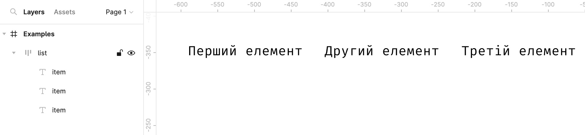
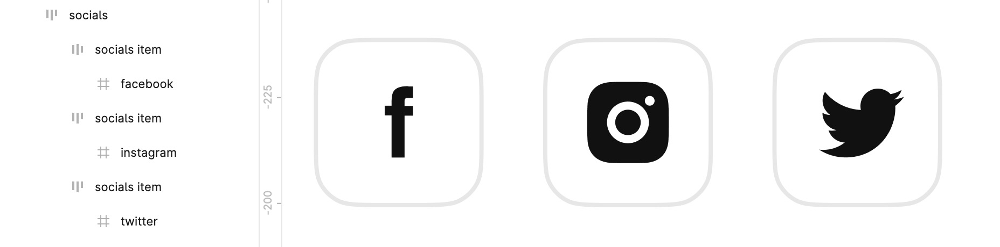
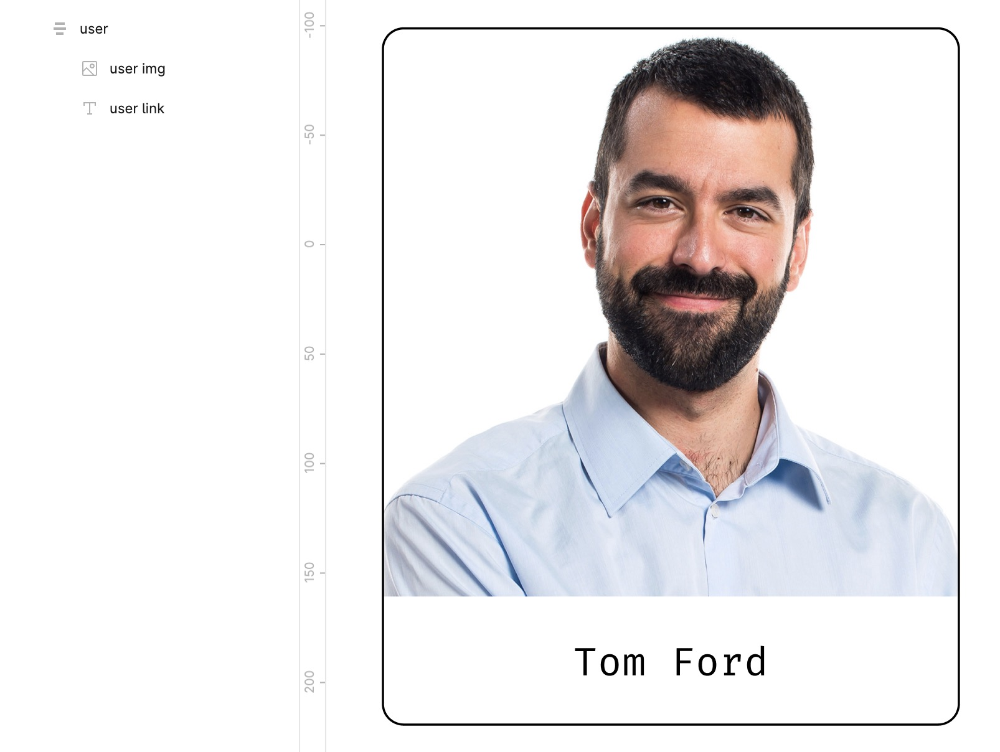
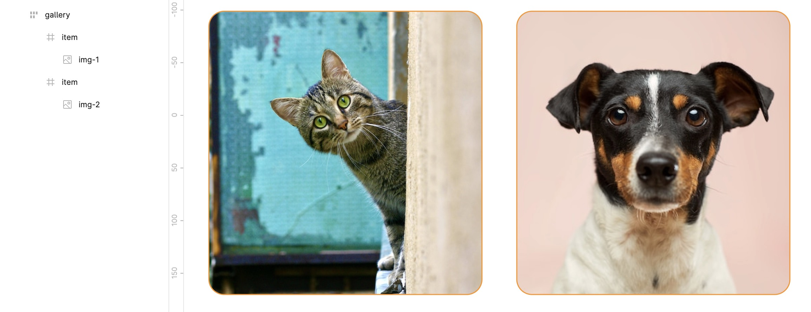
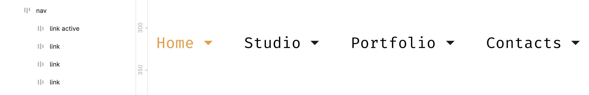
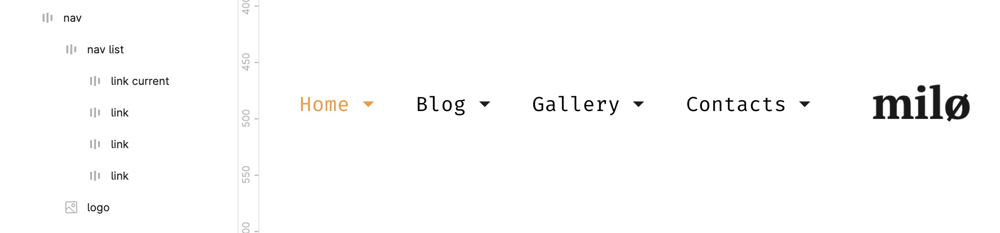
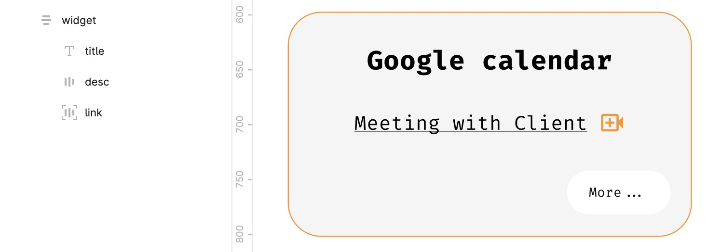
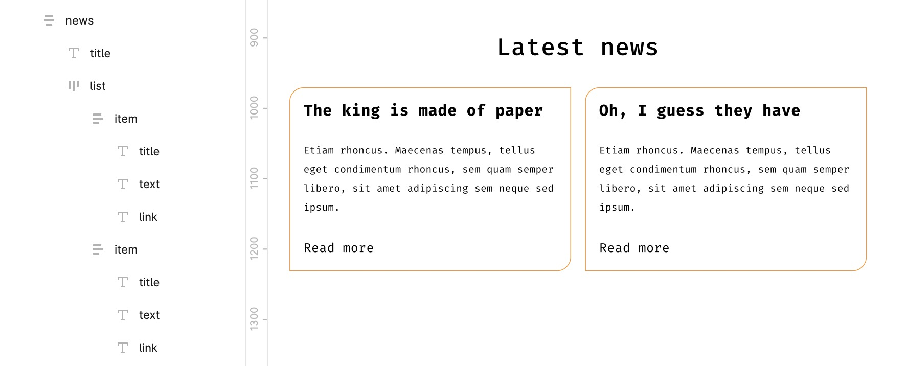

# Словник базових термінів для розробників-початківців та дизайнерів 📔

## Блоки

`page` — кореневий елемент сторінки

`header` — шапка (сторінки чи елемента)

`footer` — підвал (сторінки чи елемента)

`section` — великий розділ, що об'єднує вміст за смисловим значенням

`main`, `body` — основна частина (сторінки чи елемента)

`navigation`, `nav` - основна навігація (сторінки чи елемента)

`content` — вміст елемента

`sidebar`, `navbar` — бокова колонка (сторінки чи елемента)

`aside` — блок з додатковою інформацією

`widget` — віджет, наприклад, в боковій колонці

## Компонування шарів

`container`, `holder`, `box` — основний контейнер сторінки

`wrapper`, `wrap` — обгортка, як правило зовнішня

`inner` — внутрішня обгортка

`grid` — сітка сторінки чи елемента (зазвичай містить рядки і колонки та внутрішні відступи)

`row` — контейнер у вигляді рядка

`col`, `column` — контейнер у вигляді колонки

## Списки

`list`, `items` — список

`item` — один пункт списка

## Текст

`title`, `subject`, `heading`, `headline`, `caption` — заголовок

`subtitle` — підзаголовок

`slogan` — слоган

`lead`, `tagline` — лід-абзац (абзац під заголовком, задача якого спонукати користувача переглядати сторінку далі)

`text` — текстовий контент

`desc` — опис, варіант текстового контенту

`excerpt` — уривок тексту (зазвичай використовується перед посиланням «Читати далі...»)

`quote`, `blockquote` — цитата

`snippet` — приклад вставки з кодом

`copyright`, `copy` — копірайт

## Зобарження

`image`, `img`, `picture`, `pic` — зображення (фотореалістичне)

`icon` — іконка

`logo` — логотип

`userpic`, `avatar` — юзерпік, картинка превʼю користувача

`thumbnail`, `thumb` — мініатюра, зменшене зображення

`ill`, `illustration` — ілюстрація для візуалізації змісту

## Інтерактивні елементи

`button`, `btn` — кнопка, наприклад, для відправки форми чи відкриття попап вікна

`link` — посилання

`control` — елемент контролю, наприклад, стрілки «вперед|назад» для слайдера

`dropdown` — випадаючий список

`tag`, `label` - мітка (підпис) поля для введення даних

`field` — поле для введення даних (зазвичай використовується у формах)

`switcher`, `toggler` — перемикач стану

## Різне

`search` — пошук

`socials` — блок іконок соціальних мереж

`advertisement`, `adv`, `commercial`, `promo` — рекламний блок

`features`, `benefits` — список головних особливостей товара чи послуги

`slider`, `carousel` — слайдер, інтеркативний елемент з прокручуванням вмісту

`pagination` — навігація по сторінках

`user`, `author` — користувач, автор публікації чи коментаря

`meta` — блок з додатковою інформацією, наприклад, блок міток чи дати в публікації

`cart`, `basket` — корзина

`breadcrumbs` — навигаційний ланцюжок

`more`, `all` — посилання на повну інформацію

`modal` — модальне (діалоговое) вікно

`popup` — спливаюче вікно

`tooltip`, `tip` — спливаючі підказки

`preview` — уривок, наприклад, новості чи статті, може складатися із заголовку, опису та зображення (передбачається посилання на повну версію)

`overlay` — перекриваючий шар, наприклад, для накладання декоративних ефектів на изображення чи створення затемненої підложки у модальних вікнах

`backdrop` — фон, для відведення уваги від основного контенту на сторінці і переведення фокусу користувача на спливаючий елемент

## Розміри

`tiny`, `xs` — крихітний

`small`, `sm` — маленький

`medium`, `base` — середній

`big`, `large`, `lg` — великий

`huge`, `xl` — величезний

`narrow` — вузький

`wide` — широкий

## Стани

`active`, `current` — активний елемент, наприклад, поточний пункт меню

`visible` — видимий елемент

`hidden` — прихований елемент

`error` — статус помилки

`warning` — статус попередження

`success` — статус успішного виконання задачі

`pending` — стан очікування, наприклад, при зміні статусу з **_error_** на **_warning_**

## Медіавирази для опису пристроїв

`phone`, `mobile` — мобільні пристрої

`phablet` — телефони з великими екранами (6-7")

`tablet` — планшети

`notebook`, `laptop` — ноутбуки

`desktop` — стаціонарні компʼютери

## Приклади використання

### Простий список

```html
<ul class="list">
  <li class="item">Перший елемент</li>
  <li class="item">Други елемент</li>
  <li class="item">Третій елемент</li>
</ul>
```



### Список посилань на соціальні мережі

```html
<ul class="socials">
  <li class="socials-item">
    <a class="socials-link" href="#">
      <svg class="socials-icon"></svg>
    </a>
  </li>
  <li class="socials-item">
    <a class="socials-link" href="#">
      <svg class="socials-icon"></svg>
    </a>
  </li>
  <li class="socials-item">
    <a class="socials-link" href="#">
      <svg class="socials-icon"></svg>
    </a>
  </li>
</ul>
```



### Картинка користувача (юзерпік)

```html
<div class="user">
  
  <a class="user-link" href="#">Tom Ford</a>
</div>
```



### Галерея зображень

```html
<div class="gallery">
  <ul class="gallery-list">
    <li class="gallery-item">
      
    </li>
    <li class="gallery-item">
      
    </li>
  </ul>
</div>
```



### Навігація

```html
<nav class="nav">
  <a class="nav-link active" href="#">Home</a>
  <a class="nav-link" href="#">Studio</a>
  <a class="nav-link" href="#">Portfolio</a>
  <a class="nav-link" href="#">Contacts</a>
</nav>
```



```html
<nav class="nav">
  <ul class="nav-list">
    <li class="nav-item current">
      <a class="nav-link" href="#">Home</a>
    </li>
    <li class="nav-item">
      <a class="nav-link" href="#">Blog</a>
    </li>
    <li class="nav-item">
      <a class="nav-link" href="#">Gallery</a>
    </li>
    <li class="nav-item">
      <a class="nav-link" href="#">Contacts</a>
    </li>
  </ul>
</nav>
```



### Віджет в боковій колонці

```html
<div class="widget">
  <h4 class="widget-title">Google calendar</h4>

  <div class="widget-content">
    <p class="widget-desc">Meeting with Client</p>

    <a class="widget-link" href="#">More...</a>
  </div>
</div>
```



### Новинний блок

```html
<div class="news">
  <h3 class="news-title">Latest news</h3>

  <ul class="news-list">
    <!-- зверніть увагу на прийом додавання нового класу
         для розширення простору імен -->
    <li class="news-item item-news">
      <h4 class="item-news-title">The king is made of paper</h4>
      <div class="item-news-text">
        <p>
          Etiam rhoncus. Maecenas tempus, tellus eget condimentum rhoncus, sem quam semper libero,
          sit amet adipiscing sem neque sed ipsum.
        </p>

        <a class="item-news-link" href="#">Read more</a>
      </div>
    </li>

    <li class="news-item item-news">
      <h4 class="item-news-title">Oh, I guess they have the blues</h4>
      <div class="item-news-text">
        <p>
          Etiam rhoncus. Maecenas tempus, tellus eget condimentum rhoncus, sem quam semper libero,
          sit amet adipiscing sem neque sed ipsum.
        </p>

        <a class="item-news-link" href="#">Read more</a>
      </div>
    </li>
  </ul>
</div>
```



### Стаття в блозі чи публікація (простий варіант)

```html
<article class="article">
  <h3 class="article-title">Oh, I guess they have the blues</h3>
  <time class="article-datetime">32 may, 25:87</time>

  <div class="article-author author-article">
    
    <a class="author-article-link" href="#">Daniel Wilson</a>
    <div class="author-article-desc">UI Designer</div>
  </div>

  <div class="article-content">
    Lorem ipsum dolor sit amet, consectetuer adipiscing elit. Aenean commodo ligula eget dolor.
    Aenean massa. Cum sociis natoque penatibus et magnis dis parturient montes, nascetur ridiculus
    mus. Donec quam felis, ultricies nec, pellentesque eu, pretium quis, sem.
  </div>
</article>
```


### Стаття в блозі чи публікація (складний варіант)

```html
<article class="entry">
  <header class="entry-header">
    <h3 class="entry-title title-entry">
      <a class="title-entry-link" href="#">The blind man</a>
    </h3>

    <time class="entry-datetime">32 may, 25:87</time>
  </header>

  <div class="entry-author author-entry">
    

    <a class="author-entry-link" href="#">Mark Guerrero</a>
  </div>

  <div class="entry-content">
    Nulla consequat massa quis enim. Donec pede justo, fringilla vel, aliquet nec, vulputate eget,
    arcu. In enim justo, rhoncus ut, imperdiet a, venenatis vitae, justo. Nullam dictum felis eu
    pede mollis pretium. Integer tincidunt. Cras dapibus. Vivamus elementum semper nisi. Aenean
    vulputate eleifend tellus. Aenean leo ligula, porttitor eu, consequat vitae, eleifend ac, enim.
  </div>

  <div class="entry-tags tags-entry">
    <h4 class="tags-entry-title">Tags</h4>

    <ul class="tags-entry-list">
      <li class="tags-entry-item">
        <a class="tags-entry-link" href="#">Journey</a>
      </li>
      <li class="tags-entry-item">
        <a class="tags-entry-link" href="#">Work</a>
      </li>
      <li class="tags-entry-item">
        <a class="tags-entry-link" href="#">lifestyle</a>
      </li>
    </ul>
  </div>

  <div class="entry-actions actions-entry">
    <ul class="actions-entry-list">
      <li class="actions-entry-item read">
        <a class="actions-entry-link" href="#">4 comments</a>
      </li>
      <li class="actions-entry-item write">
        <a class="actions-entry-link" href="#">Reply</a>
      </li>
      <li class="actions-entry-item share">
        <a class="actions-entry-link" href="#">Share</a>
      </li>
    </ul>
  </div>
</article>
```
